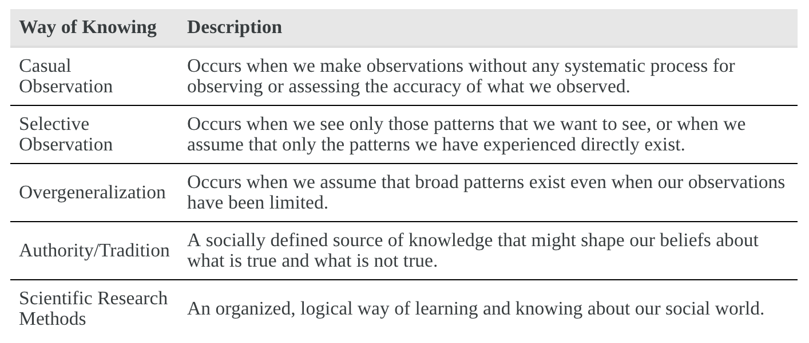
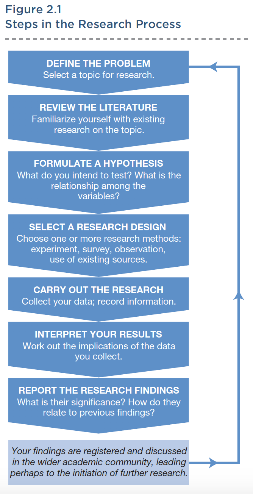
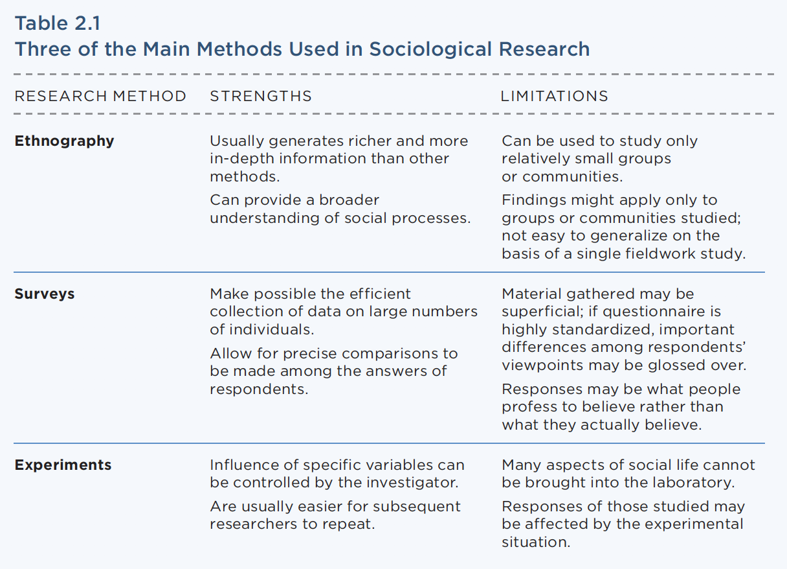

### Sociological Research Methods
SOC100: Introduction to Sociology  
Brian McPhail  
Purdue University

---
@snap[north-west]
**Sociology** is:
@snapend

@snap[west list-content-concise text-07 span-50]
@ul
- the study of the social causes of human behavior.
- the *scientific* study of the patterns and processes of human social relations.
- the *systematic* study of how people and their personal, everyday experiences affect and are affected by the larger society and its social structures and social processes.
@ulend
@snapend

@snap[east text-03 text-center span-40]

Photo by **Cameron Casey** from **Pexels**
@snapend

---

---
@snap[midpoint span-35]
]
@snapend
---
### Example

[McPhail, Brian L. "Religious Heterogamy and the Intergenerational Transmission of Religion: A Cross-National Analysis." *Religions* 2019, *10*, 109.](https://www.mdpi.com/2077-1444/10/2/109)
---
### Quantitative Methods
- Use objective and statistical data and often focus on documenting trends, comparing subgroups, or exploring correlations  
 

### Qualitative Methods
- Use personal and/or collective interviews, accounts, or observations of a person or situation
---

### Ethnography
- the firsthand study of people using participant observation, in-depth interviewing, or both.

---
### Surveys
- a method in which questionnaires are administered to the population being studied

---
### Experiments
- a method by which variables can be analyzed in a controlled and systematic way, either in an artificial situation constructed by the researcher or in a naturally occurring setting.

---

@snap[midpoint span-90]
]
@snapend
---
